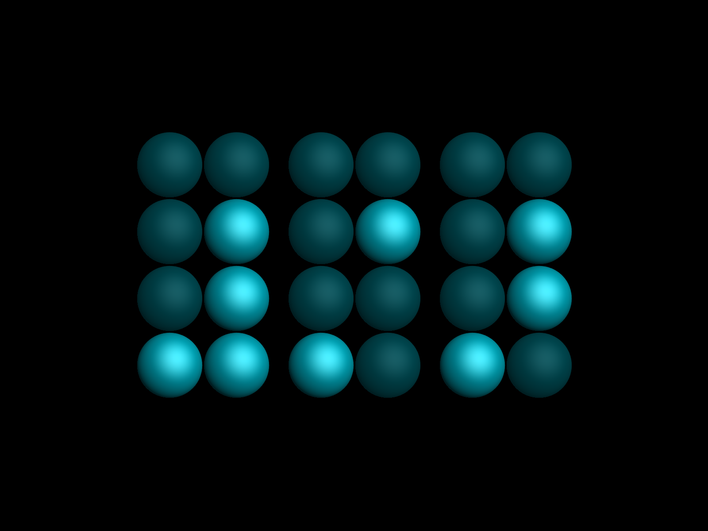

# BinaryClock

## by David Enderson



### Found a Bug?
Go to https://github.com/HaikuArchives/BinaryClock/issues and create an issue!

### What This Is:
A Binary Clock. And yes, you really can use this to tell time!  I have found it quite enjoyable to reprogram my brain to learn to read it at a glance.  It just takes a little getting used to.  Detailed directions on how to read it are included at the end of this file.

### How to read the Binary Clock:
Each column stands for a digit in a 24 hour clock with the format: XX : XX : XX
each column is configured like this:
```
8
4
2
1
```

so if you wanted 2 you would see  (O being off, X being on)
```
O
O
X
O
```

5 would be:
```
O
X
O
X
```

so 8:57:12pm would be 20:57:12 which would look like:
```
OO	OO	OO
OO	XX	OO
XO	OX	OX
OO	XX	XO
```

### Why I Wrote This:
I was inspired to write this program when I saw my college roommate, Bitscape (http://www.bitscape.org), running a program like this on his gnome bar in Linux.  I have no idea if this is the "official" layout of a binary clock or if there even is such a thing.  However, I do now believe it to be the "standard" layout since this device recently came out: 
http://www.thinkgeek.com/cubegoodies/lights/59e0/

### The Way I Developed This:
I totally rewrote it for this version, pasting only smatterings of the old code.  I used the Clock app included with BeOS R4.5 as a pattern, gutted it, and added my stuff.  I used MonoView 0.3.1 source to iron out problems, as well as a lot of trial and error.  I believe that version 2.0 and onward should provide a good example of how to correctly construct replicants.  If you downloaded the source code, the file smdots.pov is the povray source code I used to generate the graphics.  I then edited them with Becasso.

### Version History:
* 2.0: Replicant feature completely stable.  The user can now add additional graphics to the clock and choose from them in the menu.  I believe the program to be entirely stable in every way.  You should be able to use any graphic that you have a translator for.
* 1.1: I am convinced replicant feature is stable.  I got rid of the flicker and updated the graphics.  Abstracted the graphic files from the binary.  "smdots.pov" is what I used to render the graphics.
* 1.0 Gamma: Replicant feature and popup menu added.  Seems to slow Tracker somewhat.
* 0.5: Graphics added
* 0.3: Initial Release

### Special Thanks to:
* Okada Jun, for use of his MonoView source,
* Be, Inc. for the use of the Clock source,
* [geo] on #bedev for advice, moral support, and testing
* Beta testers: John Strickland, Paul Tomlinson, and Brett O'Hare
* POVRay and Becasso: for making great graphic creation and editing tools
